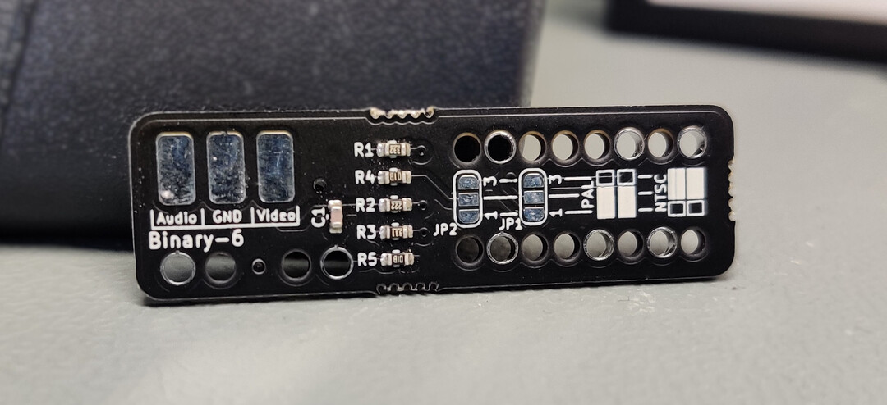
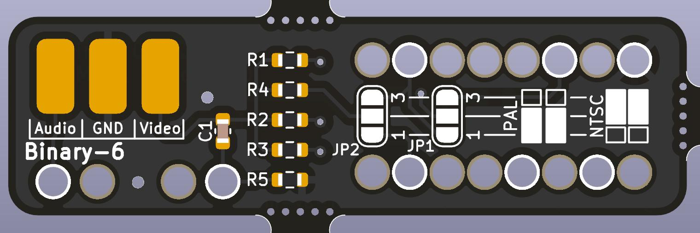
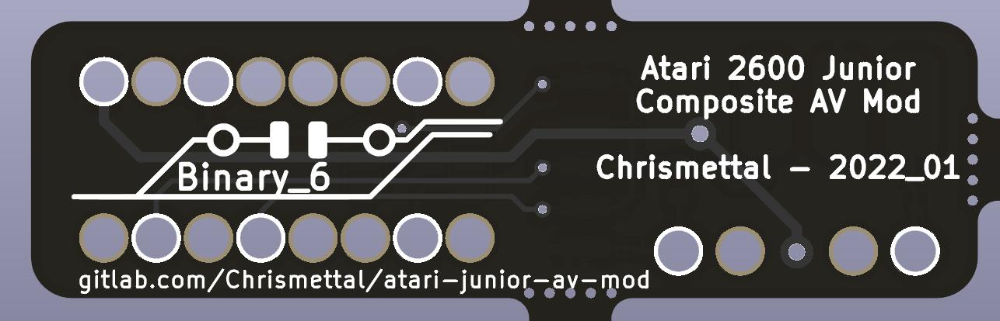

# Atari 2600 Junior composite AV mod <!-- omit in toc -->

This is a single board solution to mod Atari 2600 Junior consoles, which normally only use RF outputs, into outputting composite AV.

Analog RF isn't typically found on most modern TVs anymore, and even composite AV is fading out, but it is still fairly easy to hook up on most systems.

This mod in general isn't anything new, it has been for literal decades but usually it was done with free floating wires and components. This PCB aims to make installation a lot easier.

All files to manufacture your own boards are uploaded in the [production files directory](/pcb/production%20files/), but for your convenience, finished boards are also stocked at [Tindie](https://www.tindie.com/products/binary-6/2600-junior-composite-av-mod-atari/).

If you like my work please consider supporting my caffeine addiction!

## Table of contents <!-- omit in toc -->

- [Installation](#installation)
  - [Stuff required](#stuff-required)
  - [Opening the console](#opening-the-console)
  - [Placing the mod](#placing-the-mod)
  - [Choosing between PAL and NTSC](#choosing-between-pal-and-ntsc)
  - [Wiring it up](#wiring-it-up)
- [Making your own](#making-your-own)
- [Ancient version](#ancient-version)
- [Sources](#sources)
- [License](#license)

## Installation

This installation guide was done on a **Rev C Junior board**.

### Stuff required

- AV Modchip
- Audio / Video ports of your liking (RCA for example)
- Screened wire (Stereo audio cable works well)
- Soldering iron
- Screwdrivers / Pliers
- 30 Minutes of time

### Opening the console

The case gets flipped on its face and 5 screws will be removed. On the front you
will find some clips that need to be carefully opened as well. The old plastic likes
to break easily.

The metal panel has multiple bent tabs around the perimiter that need to be bent
straight again to take the panel off.

### Placing the mod

In the lower left hand corner there is the backside of the CD4050 IC. Place the modchip according to the picture. It will fit over all pins in
the area. There are 7 contacted holes that need to be soldered in. This will
connect all video as well as audio signals to the modboard. Sometimes you are required to bend some pins up with a screwdriver if the chip does not fit perfectly.

### Choosing between PAL and NTSC

You will need to set **JP1** and **JP2** according to your system. Both jumpers need to be connected **MIDDLE-DOWN** (1-2) for PAL systems, or **MIDDLE-UP** (2-1) for NTSC systems.

If you fail to connect any jumpers, you will not get any usable video out of your system, but nothing will break.

In this guide, Both jumpers were set **MIDDLE-DOWN** since I am using a PAL system.

### Wiring it up

The top left corner of the chip has contacts for audio and video, in my case:

- Screening – GND
- Red – Audio
- White – Video

I wired up a triple RCA jack here, putting the audio signal on both center pins of
the red and white jack for left and right audio, the video signal onto the center
pin of the yellow jack, and GND on the outer ring of all three

After routing the wires you can put the screening panel back on and bend the
metal tabs back into place

This is what the ports could look like. Of course you don’t have to put the jacks as
crooked as I did.

## Making your own

All files to manufacture your own boards are uploaded in the [production files directory](/pcb/production%20files), but for your convenience, finished boards are also stocked at [Tindie](https://www.tindie.com/products/binary-6/2600-junior-composite-av-mod-atari/).

The production files were created with [JLCPCB](https://jlcpcb.com) in mind. The BOM and Gerbers specifically fit their requirements to have the full PCB panel including PCBA assembly manufactured with them. Alternatively, in the [BOM](/pcb/production%20files/bom/atari-junior-av-mod.csv) you will find LCSC part numbers to buy the parts at [LCSC](https://lcsc.com) individually.

## Ancient version

The initial version was never published open source, but has been added here for legacy documentation purposes. 

It was originally done in EAGLE but imported into KiCad. No fabrication files are provided and the files are not imported perfectly. The manual still references this version of the board, as the general installation procedure did not really change. 

The old version was only compatible to PAL systems, while the new board released here also works on NTSC systems, as long as your Atari junior board revision fits mechanically.

## Sources

- Differences between PAL and NTSC PCBs by were documented in [AtariAge forums](https://atariage.com/forums/topic/309021-atari-2600-ntsc-simple-diy-composite-mod/).
- Ancient version was first published and documented in [CircuitBoard forums](https://circuit-board.de/forum/index.php/Thread/22430-Atari-2600-Junior-AV-Mod-mit-neuer-PCB/), referencing an original tutorial [in the same forum](https://circuit-board.de/forum/index.php/Thread/1886-Atari-2600-Junior-Video-Mod-ohne-Zusatzplatine/).

## License

 This work is licensed under a <a rel="license" href="http://creativecommons.org/licenses/by-nc-sa/4.0/">Creative Commons Attribution-NonCommercial-ShareAlike 4.0 International License</a>.